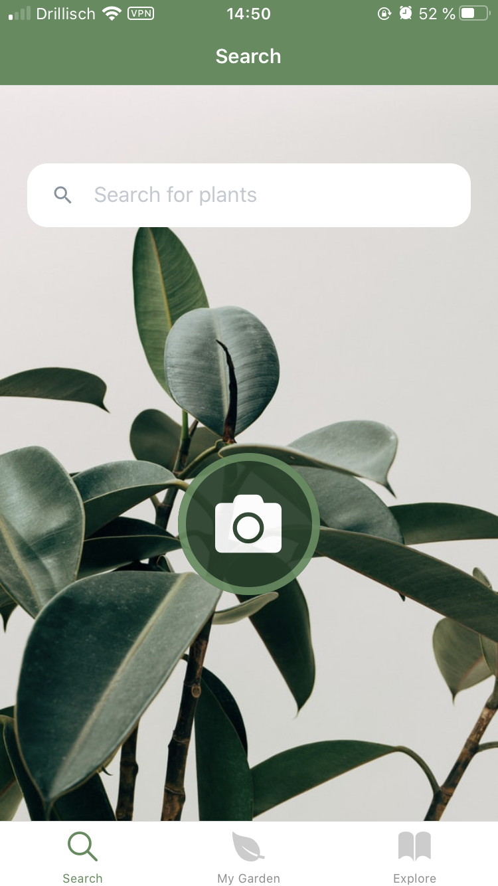

# Pflanzy-mobile-app

<strong>Find relevant information on how to grow house plants correctly and get reminded when your plants need care - All in one place</strong> 

 

Pflanzy is a native Application for iOS and Android which was developed with React Native using one code base. The app allows you to look up numerous types of house plants, add plants to your garden, set up reminders with notifications such as water, fertilizer, and re-potting, personalize your plant by renaming it and adding a picture of it, as well as browse through various interesting articles about house plants.

## Demo

This are some examples of how the app should look, once installed.

## Motivation

- Final Project for one-year course at DCI Berlin
- A team which is passionate about house plants
- Desire to help others take care of their plants
- Curiosity for mobile development
- Ambition to learn React native
- Possibility to develop a native app for iOS and Android with one code base

## Technologies used

- React Native
- Redux
- Expo
- Firebase

## Getting started

1. Download and install the developer tool [Expo](https://play.google.com/store/apps/details?id=host.exp.exponent&hl=es) to run the app.

2. Clone our [Pflanzy](git@github.com:Pflanzy/Pflanzy-mobile-app.git) repository.

> \$ git clone https://github.com/Pflanzy/Pflanzy-mobile-app

3. Install and run npm:

   > \$ npm install -g expo-cli
   >
   > \$ npm run start

4. Scan the QR code you will get with Expo once installed.

5. Enjoy!

## Contributing

1. Fork it (https://github.com/Pflanzy/Pflanzy-mobile-app)
2. Create your feature branch (git checkout -b feature/myContribution)
3. Commit your changes (git commit -am 'Add some contribution')
4. Push to the branch (git push origin feature/myContribution)
5. Create a new Pull Request

## License

MIT © [Pflanzy](https://github.com/Pflanzy/Pflanzy-mobile-app/blob/master/LICENSE)
