# Pflanzy

Your app to find relevant information on how to grow your room plants properly and allow others benefit from your own knowledge.

## What can I do with Pflanzy?

Once the app is installed, you will find yourself in our main screen.

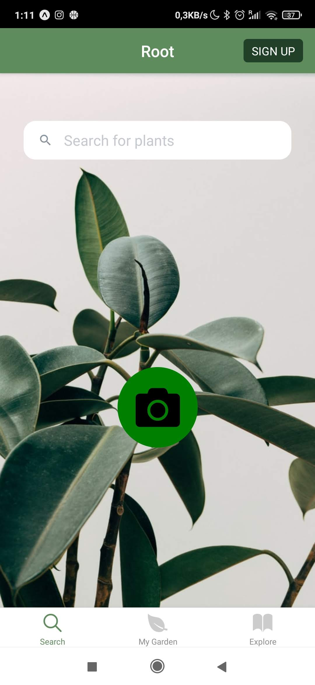

One of the first options you will face is to sign in.

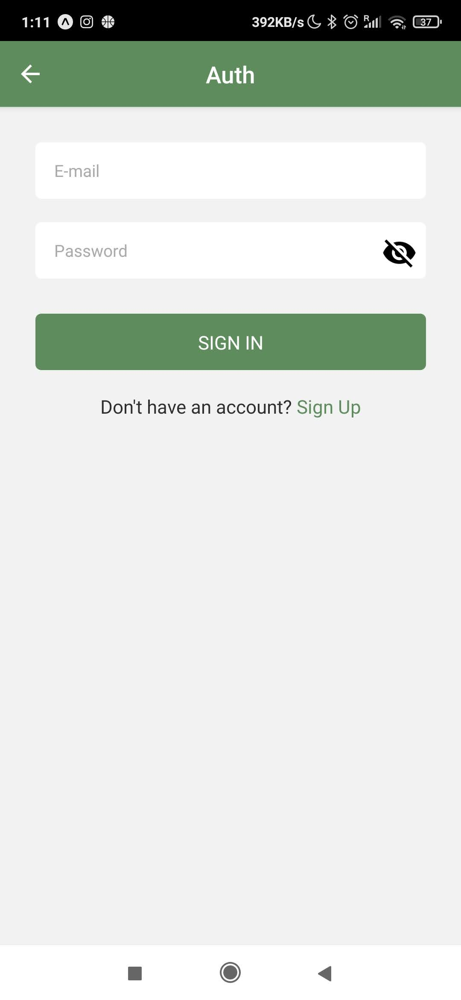

If it's your first time with us, just click in the sign up option bellow.

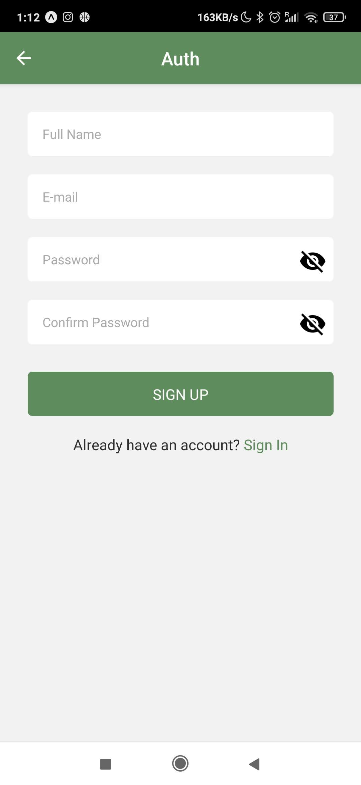

Of course, this is not mandatory. If you just want information about a specific plant, write its name in the search bar.

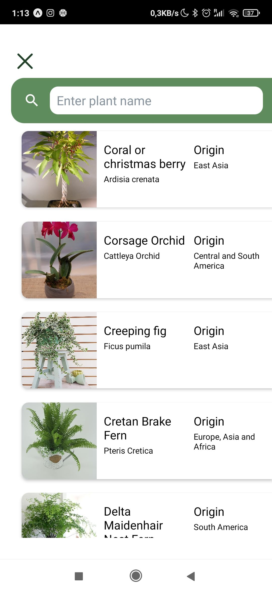

If you don't know the name of you plant, do not worry. You can simply take a picture of it, and you will get instantly all the information we have about the plant.

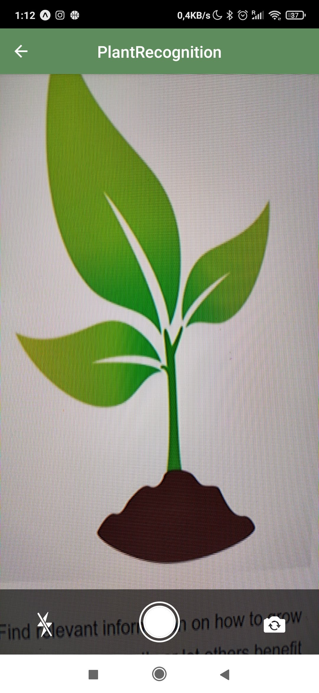

Such as a brief description.

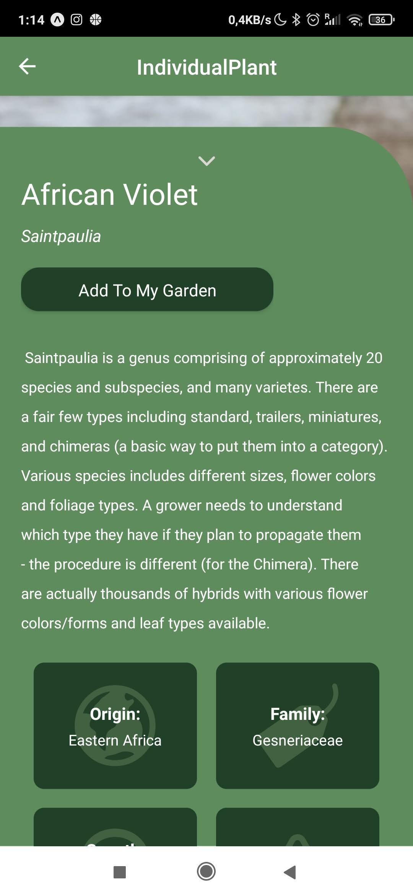

Some basic info.

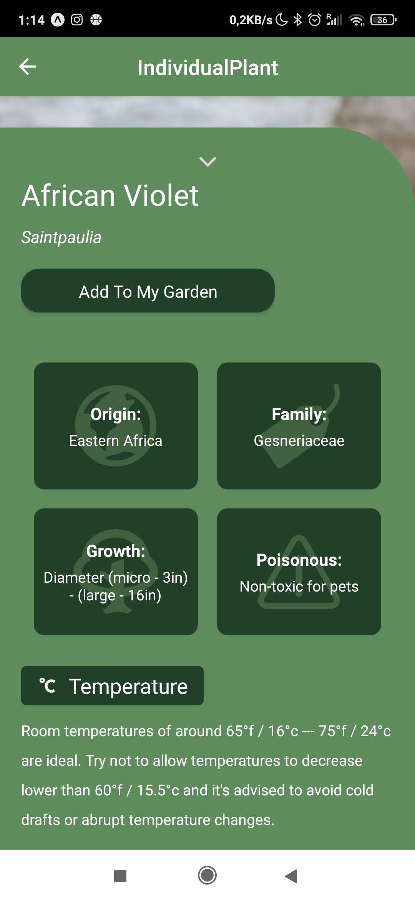

Or more detailed information.

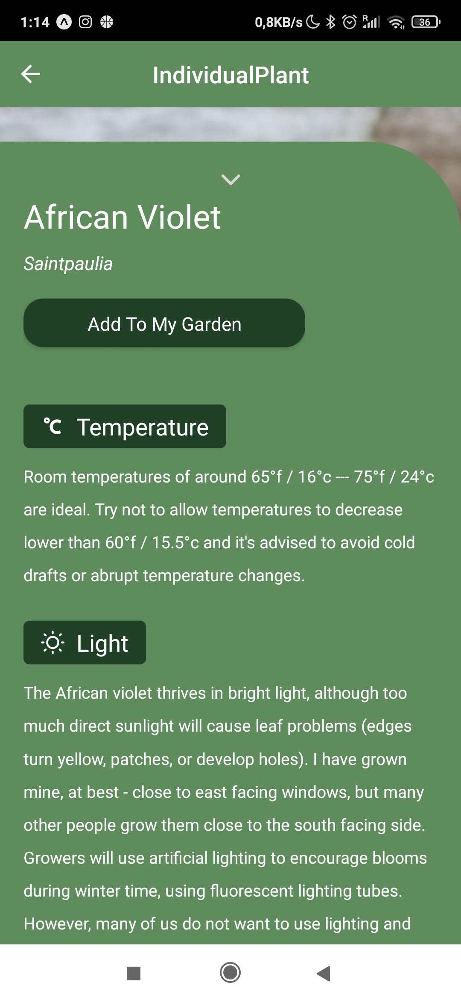

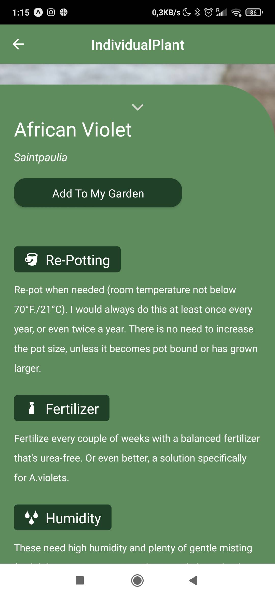

You can also "click" in "Add To My Garden" to save the plant as a favorite.

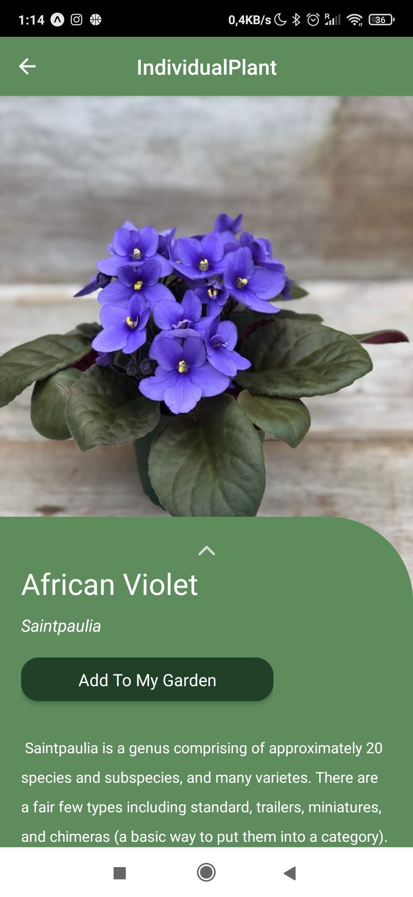

To find that plant later, just go into "My Garden", in the main screen.

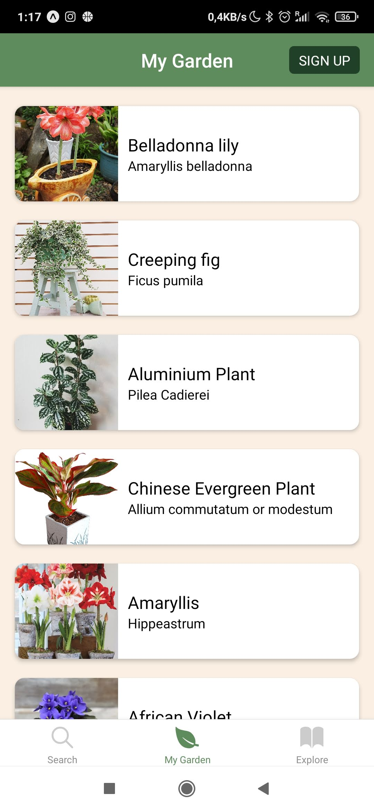

Here there some new options, as set reminder or the possibility to rename your plant.

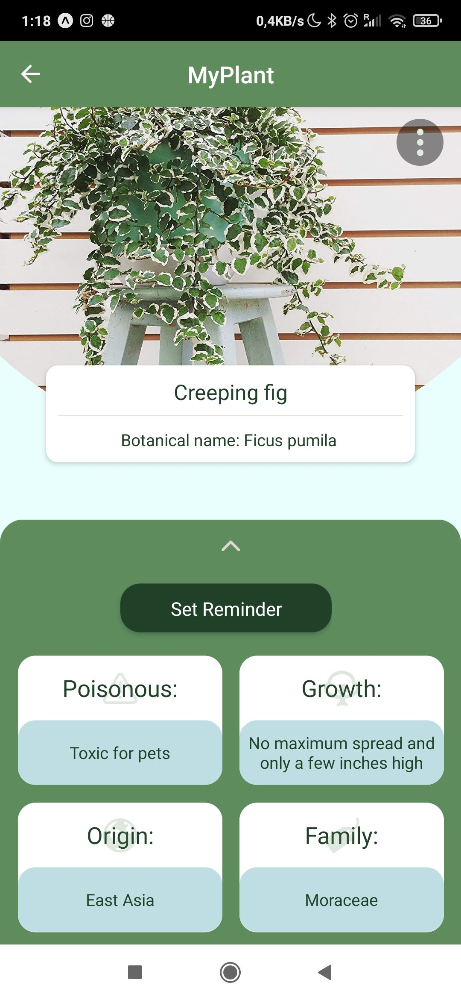

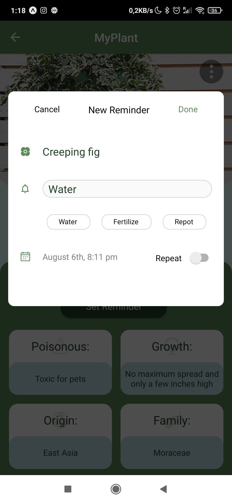

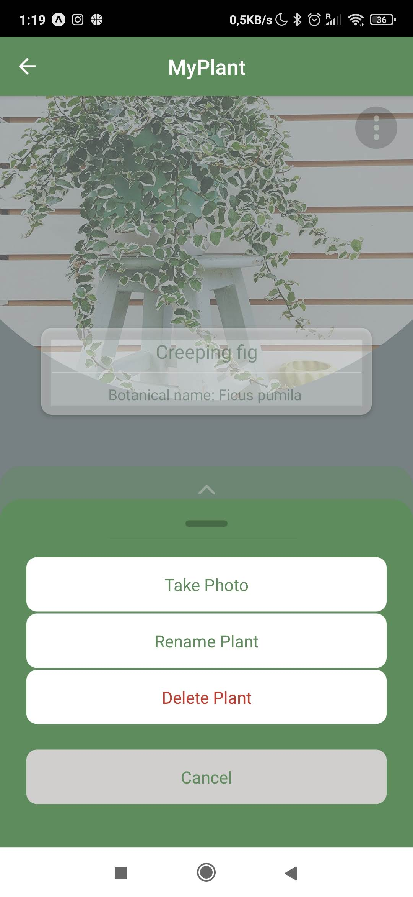

You may also find interesting the "Explore" section, where you will find many articles with interesting tips for our plants.

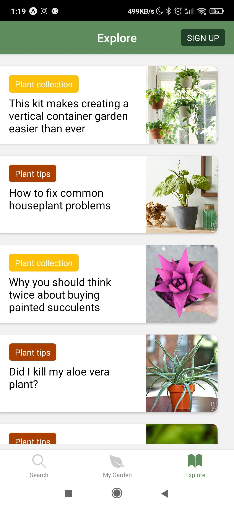
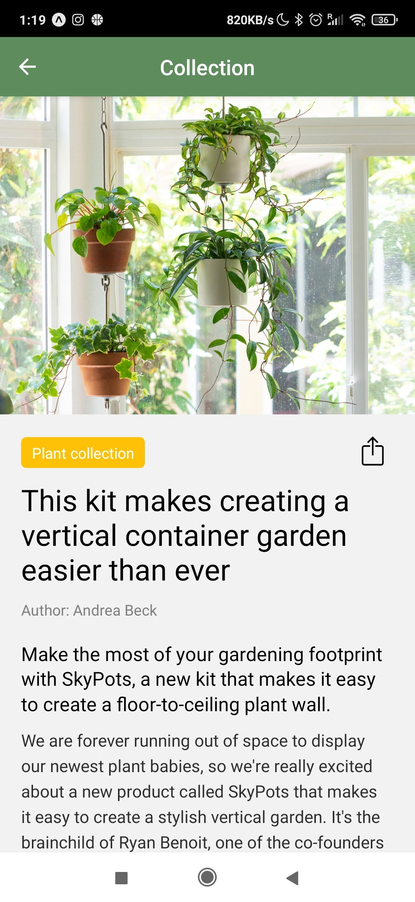

## Installation

1. Download and install the developer tool [Expo](https://play.google.com/store/apps/details?id=host.exp.exponent&hl=es) to run the app.

2. Scan [this QR code](Here would come the QR code we should provide to the users) with the recently installed app Expo.

3. And that's all. We are hopping you enjoy the experience!

## License

MIT © [Pflanzy](https://github.com/Pflanzy/Pflanzy-mobile-app/blob/master/license)
